---
layout: post
title: "余额宝快报微信公众平台数据分析报告"
description: ""
category: statistics
tags: [wechat , weibo , ali_bao ]
---



1 概述
-----------------------


### 1.1  报告所涉数据来源

本报告所涉主要数据均来自「余额宝快报」微信公共平台所收集的数据，时间范围为2013年7月23日起至2013年10月7日止。部分用作对比数据（如各省市网民数）来自中国互联网络中心2013年发布的《第31次中国互联网网络发展状况统计报告》。
  
「余额宝快报」微信公共平台于7月13号注册，后台开发于7月21日完成，从23日开始产生完整的信息数据记录，所以本报告以2013年7月23日起至2013年10月7日止，14个自然日的数据为样本。

### 1.2	为什么要做这样的报告分析

「余额宝快报」微信公共平台推出以来受到用户欢迎，目前累计用户超过5000，每天处理1800次以上的用户互动查询，但用户及每天互动的消息数增长速度并未达到预期。通过本报告，了解细化用户的需求，了解他们的活跃时间，推出个性化的内容及服务。


  
2 数据分析与可视化
-----------------------

### 2.1	整体概况

截至2013-8-5日，余额宝快报共有1058位用户，其中7月23日起至8月5日共新增用户821名。

### 2.2 数据准备


### 2.3 基金收益分析

* 基金收益样例数据


```
##          day profit  rate          updatetime
## 1 2013-07-16  1.221 4.634 2013-07-16 00:00:00
## 2 2013-07-17  1.183 4.582 2013-07-17 22:17:35
## 3 2013-07-18  1.190 4.543 2013-07-18 19:16:03
## 4 2013-07-19  1.203 4.518 2013-07-19 19:05:59
## 5 2013-07-20  1.196 4.494 2013-07-20 08:10:25
## 6 2013-07-21  1.196 4.471 2013-07-21 00:04:50
```


* 基金收益数据分析：


```
##       day                 profit          rate     
##  Min.   :2013-07-16   Min.   :1.15   Min.   :4.37  
##  1st Qu.:2013-08-04   1st Qu.:1.21   1st Qu.:4.51  
##  Median :2013-08-24   Median :1.22   Median :4.55  
##  Mean   :2013-08-24   Mean   :1.25   Mean   :4.66  
##  3rd Qu.:2013-09-12   3rd Qu.:1.26   3rd Qu.:4.86  
##  Max.   :2013-10-02   Max.   :1.51   Max.   :5.07  
##    updatetime                 
##  Min.   :2013-07-16 00:00:00  
##  1st Qu.:2013-08-05 01:49:44  
##  Median :2013-08-24 09:25:04  
##  Mean   :2013-08-24 15:28:10  
##  3rd Qu.:2013-09-13 05:59:38  
##  Max.   :2013-10-02 08:48:46
```

通过对基金的收益分析可以看出：1)系统的统计时（day）间为2013-07-16到 2013-10-02;
2)每日万份收益最小值为1.15，最大值为1.51，均值为1.25

下面对每日万份收益做详细的分析
* 每日万份收益 整体分析

```
##    Min. 1st Qu.  Median    Mean 3rd Qu.    Max. 
##    1.15    1.21    1.22    1.25    1.26    1.51
```

 * 均值与方差


```
## [1] 1.252
```

```
## [1] 0.07796
```


 * 每日万份收益统计时间序列图

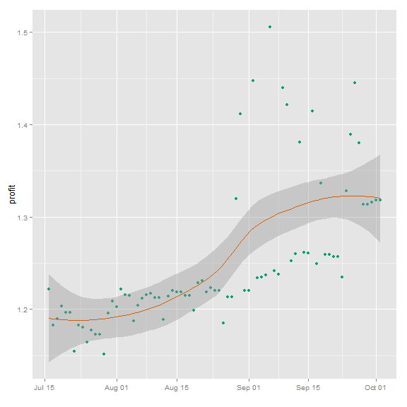

由上图可以看出，通过loess（局部加权回归散点平滑法locally weighted scatterplot smoothing，LOWESS或LOESS）回归拟合，在8月25日-9月25日拟合较差，这期间收益涨跌幅度较大。


 * 每日万份收益统计箱须图

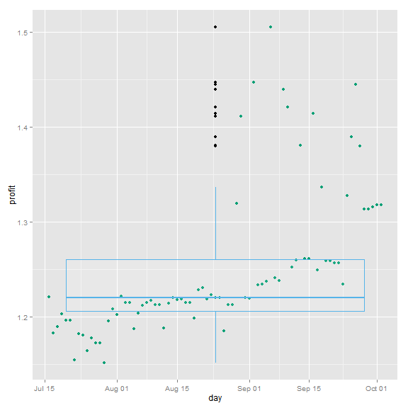


* 每日万份收益统计直方图

```
## Warning: position_stack requires constant width: output may be incorrect
```

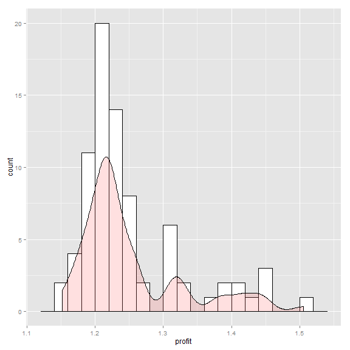


2.2 用户分析


* 样例数据


```
##          day subscribe unsubscribe newuser totaluser
## 1 2013-07-23        50           9      41       547
## 2 2013-07-24        43           2      41       588
## 3 2013-07-25        38           3      35       623
## 4 2013-07-26        21           2      19       642
## 5 2013-07-27        36           9      27       669
## 6 2013-07-28        63           9      54       723
```

其中，subscribe表示每日新关注人数，unsubscribe表示每日取消关注人数，newuser表示净增关注人数，totaluser表示累计关注人数。

* 数据统计分析

```
##       day               subscribe      unsubscribe    newuser     
##  Min.   :2013-07-23   Min.   : 21.0   Min.   : 2   Min.   : 18.0  
##  1st Qu.:2013-08-09   1st Qu.: 42.8   1st Qu.: 7   1st Qu.: 35.0  
##  Median :2013-08-27   Median : 57.0   Median : 9   Median : 47.0  
##  Mean   :2013-08-27   Mean   : 70.2   Mean   : 9   Mean   : 61.2  
##  3rd Qu.:2013-09-14   3rd Qu.: 79.2   3rd Qu.:11   3rd Qu.: 70.0  
##  Max.   :2013-10-02   Max.   :255.0   Max.   :23   Max.   :237.0  
##    totaluser   
##  Min.   : 547  
##  1st Qu.:1342  
##  Median :2186  
##  Mean   :2398  
##  3rd Qu.:3420  
##  Max.   :4913
```


对数据进行重塑，

通过melt融合数据,为是统计更直观，暂时取消,newuser,totaluser数据


融合后代数据样例


```
##          day      type cnt
## 1 2013-07-23 subscribe  50
## 2 2013-07-24 subscribe  43
## 3 2013-07-25 subscribe  38
## 4 2013-07-26 subscribe  21
## 5 2013-07-27 subscribe  36
## 6 2013-07-28 subscribe  63
```


* 用户每日时间序列图

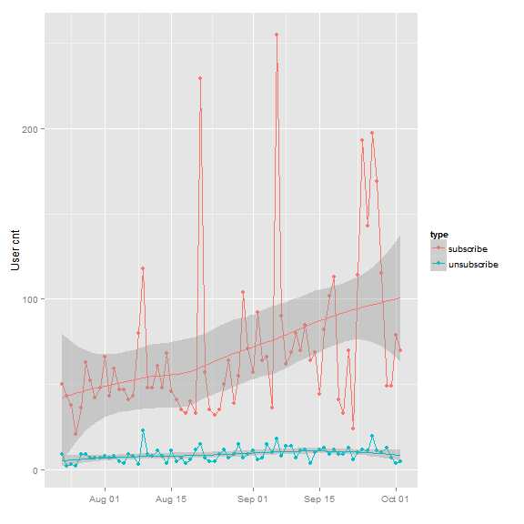


由上图可以大致看出，每日新增关注人数和每日取消关注人数有一定的关联关系，当新增用户数增加时，取消关注的人数也会增加，下图为将数据进行标准正态化后的比较，二者的关联关系较为明显，这一块暂时不做详细的分析。

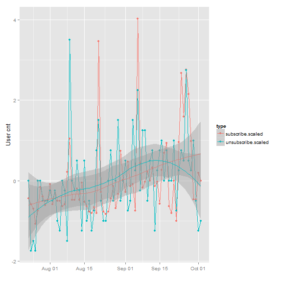


* 重点研究下每日净新增的用户人数


```
##    Min. 1st Qu.  Median    Mean 3rd Qu.    Max. 
##    18.0    35.0    47.0    61.2    70.0   237.0
```


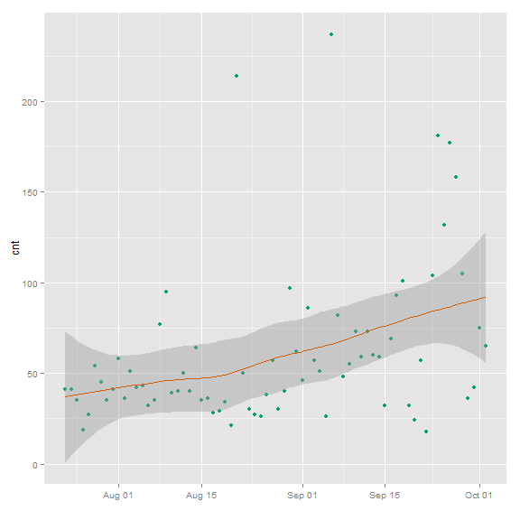


* 用户性别分析


### 2.3 消息统计分析
----------------
消息样例数据

```
##     id userid sex             msgtime        day hour msg_type type_detail
## 1  254      5   1 2013-07-23 00:24:03 2013-07-23    0        1       query
## 2  255      5   1 2013-07-23 00:38:35 2013-07-23    0        1       query
## 3  256      5   1 2013-07-23 00:38:41 2013-07-23    0        1       query
## 4  257      5   1 2013-07-23 00:45:03 2013-07-23    0        5 unsubscribe
## 5  258      5   1 2013-07-23 00:46:24 2013-07-23    0        5   subscribe
## 6  259     16   1 2013-07-23 01:46:28 2013-07-23    1        1     compute
## 7  260     16   1 2013-07-23 01:46:52 2013-07-23    1        1     compute
## 8  261     87   0 2013-07-23 03:30:59 2013-07-23    3        5   subscribe
## 9  262     88   0 2013-07-23 04:04:08 2013-07-23    4        5   subscribe
## 10 263      0   1 2013-07-23 05:01:19 2013-07-23    5        1     compute
##    content
## 1       cx
## 2   f%h/"
## 3       cx
## 4     <NA>
## 5     <NA>
## 6  Js35924
## 7  Js35624
## 8     <NA>
## 9     <NA>
## 10 js10000
```

```
## [1] 70869     9
```

```
##        id            userid          sex      
##  Min.   :  254   Min.   :   0   Min.   :0     
##  1st Qu.:18241   1st Qu.: 797   1st Qu.:0     
##  Median :35958   Median :1940   Median :1     
##  Mean   :35954   Mean   :2093   Mean   :1     
##  3rd Qu.:53675   3rd Qu.:3067   3rd Qu.:1     
##  Max.   :71392   Max.   :5393   Max.   :2     
##                                 NA's   :5306  
##     msgtime                         day                  hour     
##  Min.   :2013-07-23 00:24:03   Min.   :2013-07-23   Min.   : 0.0  
##  1st Qu.:2013-08-21 23:48:05   1st Qu.:2013-08-21   1st Qu.:11.0  
##  Median :2013-09-07 10:15:19   Median :2013-09-07   Median :17.0  
##  Mean   :2013-09-04 22:36:36   Mean   :2013-09-04   Mean   :14.8  
##  3rd Qu.:2013-09-20 20:11:58   3rd Qu.:2013-09-20   3rd Qu.:19.0  
##  Max.   :2013-10-02 20:13:20   Max.   :2013-10-02   Max.   :23.0  
##                                                                   
##     msg_type       type_detail             content     
##  Min.   :1.00   compute  :41201   c            : 6785  
##  1st Qu.:1.00   query    :14319   001          : 2458  
##  Median :1.00   question : 5759   C            : 2318  
##  Mean   :1.33   subscribe: 5055   f\0246g\033\n: 1720  
##  3rd Qu.:1.00   help     : 1607   10000        : 1375  
##  Max.   :5.00   other    : 1379   (Other)      :50367  
##                 (Other)  : 1549   NA's         : 5846
```

不同消息数量对比


```
## Error: could not find function "trans_breaks"
```


每天的消息数比较
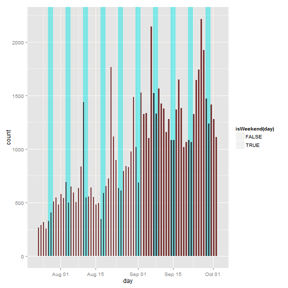

蓝色背景表示当天是周末，可以看到一般在周末，消息数量就会较少。

每天的消息数比较
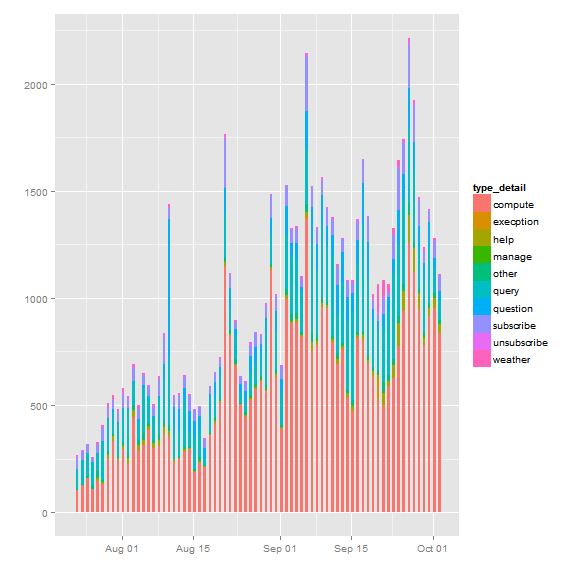

蓝色背景表示当天是周末，可以看到一般在周末，消息数量就会较少。


3  信息挖掘
-------------


### 3.1 对每日新增关注人数的做回归分析

通过前面的分析,可以大致的看出,每日新增人数和每日万份收益,是否是周末有一定的关系.通过对数据做正态标准化,详见下图


```
##                   day profit subscribe isweekend
## 2013-07-23 2013-07-23  1.183        50     FALSE
## 2013-07-24 2013-07-24  1.181        43     FALSE
## 2013-07-25 2013-07-25  1.165        38     FALSE
## 2013-07-26 2013-07-26  1.178        21     FALSE
## 2013-07-27 2013-07-27  1.173        36      TRUE
## 2013-07-28 2013-07-28  1.173        63      TRUE
```

```
##             profit subscribe
## 2013-07-23 -0.9472   -0.4405
## 2013-07-24 -0.9738   -0.5931
## 2013-07-25 -1.1760   -0.7021
## 2013-07-26 -1.0091   -1.0726
## 2013-07-27 -1.0711   -0.7457
## 2013-07-28 -1.0736   -0.1571
```

```
## Error: Invalid input: date_trans works with objects of class Date only
```


对


```
## 
## Call:
## lm(formula = subscribe ~ profit + isweekend, data = subscribeanalysis)
## 
## Residuals:
##    Min     1Q Median     3Q    Max 
##  -64.9  -19.4   -3.0   10.9  164.8 
## 
## Coefficients:
##               Estimate Std. Error t value Pr(>|t|)    
## (Intercept)    -345.85      72.13   -4.80  9.0e-06 ***
## profit          333.18      56.78    5.87  1.4e-07 ***
## isweekendTRUE   -10.52       9.96   -1.06     0.29    
## ---
## Signif. codes:  0 '***' 0.001 '**' 0.01 '*' 0.05 '.' 0.1 ' ' 1
## 
## Residual standard error: 37.1 on 69 degrees of freedom
## Multiple R-squared:  0.364,	Adjusted R-squared:  0.346 
## F-statistic: 19.7 on 2 and 69 DF,  p-value: 1.66e-07
```

```
## [1] 69  4
```

```
## 
## Call:
## lm(formula = subscribe ~ profit, data = sa)
## 
## Residuals:
##    Min     1Q Median     3Q    Max 
## -44.63 -20.10  -3.49  11.35  82.05 
## 
## Coefficients:
##             Estimate Std. Error t value Pr(>|t|)    
## (Intercept)   -273.4       52.9   -5.17  2.3e-06 ***
## profit         268.8       42.1    6.38  1.9e-08 ***
## ---
## Signif. codes:  0 '***' 0.001 '**' 0.01 '*' 0.05 '.' 0.1 ' ' 1
## 
## Residual standard error: 25.8 on 67 degrees of freedom
## Multiple R-squared:  0.378,	Adjusted R-squared:  0.368 
## F-statistic: 40.7 on 1 and 67 DF,  p-value: 1.93e-08
```

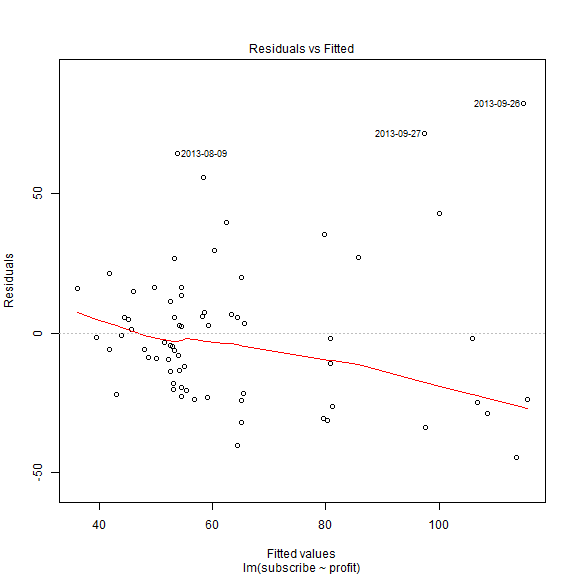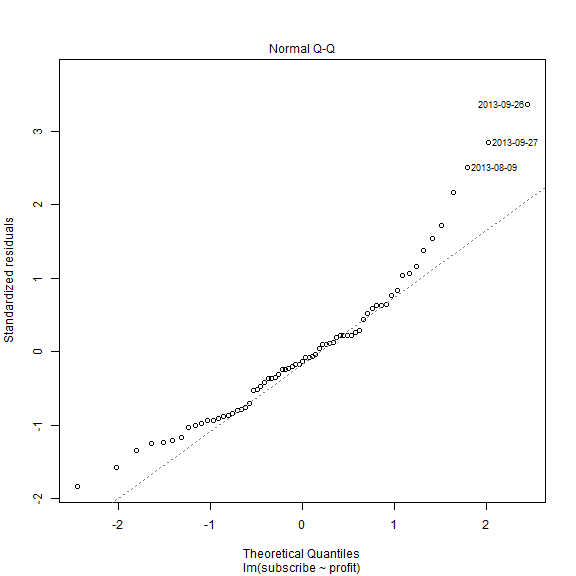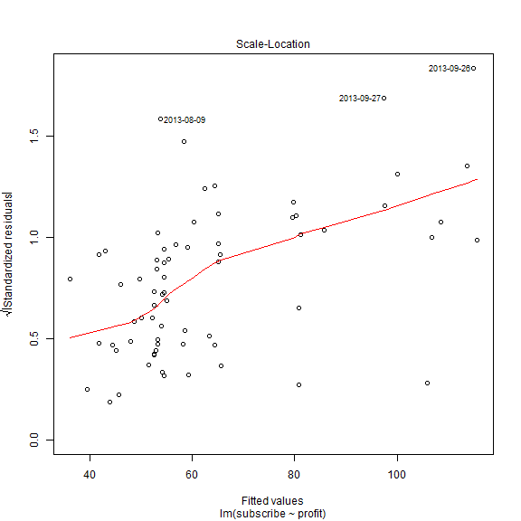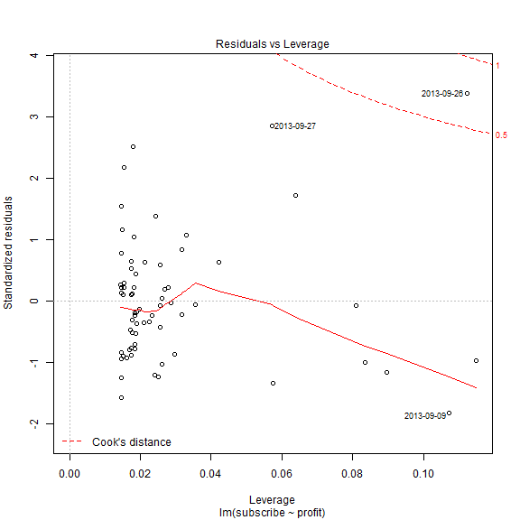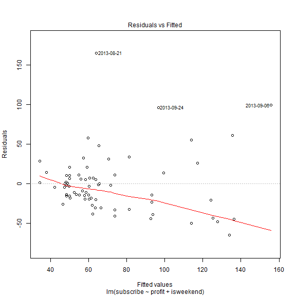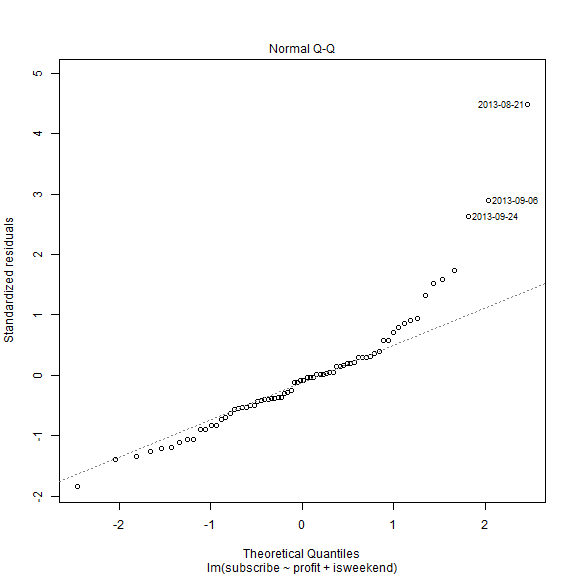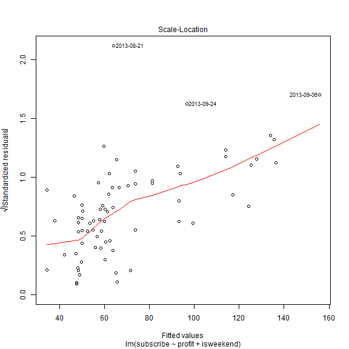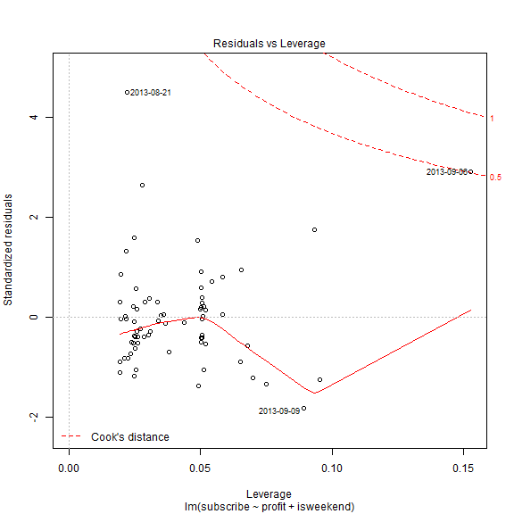


通过线性回归可以看出，和是否是周末没有太大的关系
绘图展示
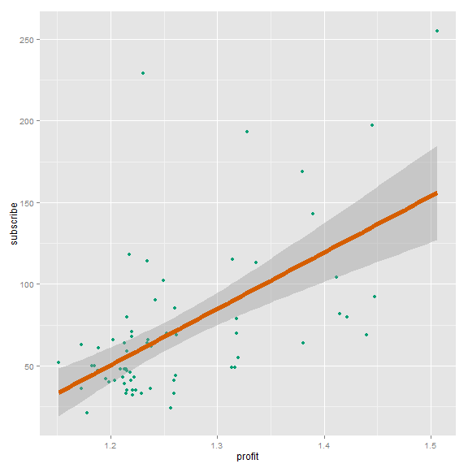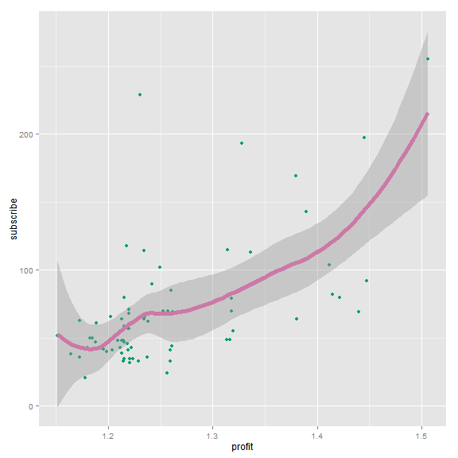

```
## Call:
## loess(formula = subscribe ~ profit, data = subscribeanalysis2)
## 
## Number of Observations: 72 
## Equivalent Number of Parameters: 5.2 
## Residual Standard Error: 36.5 
## Trace of smoother matrix: 5.7 
## 
## Control settings:
##   normalize:  TRUE 
##   span	    :  0.75 
##   degree   :  2 
##   family   :  gaussian
##   surface  :  interpolate	  cell = 0.2
```


### 3.2 对每天消息数做回归分析


```
##    id userid sex             msgtime        day hour msg_type type_detail
## 1 254      5   1 2013-07-23 00:24:03 2013-07-23    0        1       query
## 2 255      5   1 2013-07-23 00:38:35 2013-07-23    0        1       query
## 3 256      5   1 2013-07-23 00:38:41 2013-07-23    0        1       query
## 4 257      5   1 2013-07-23 00:45:03 2013-07-23    0        5 unsubscribe
## 5 258      5   1 2013-07-23 00:46:24 2013-07-23    0        5   subscribe
## 6 259     16   1 2013-07-23 01:46:28 2013-07-23    1        1     compute
##   content
## 1      cx
## 2  f%h/"
## 3      cx
## 4    <NA>
## 5    <NA>
## 6 Js35924
```

```
## [1] 70869     9
```

```
## 2013-07-23 2013-07-24 2013-07-25 2013-07-26 2013-07-27 2013-07-28 
##        269        290        317        257        327        406
```

```
## [1] 72
```

```
## [1] "array"
```

```
##                   day profit subscribe message isweekend
## 2013-07-23 2013-07-23  1.183        50     269     FALSE
## 2013-07-24 2013-07-24  1.181        43     290     FALSE
## 2013-07-25 2013-07-25  1.165        38     317     FALSE
## 2013-07-26 2013-07-26  1.178        21     257     FALSE
## 2013-07-27 2013-07-27  1.173        36     327      TRUE
## 2013-07-28 2013-07-28  1.173        63     406      TRUE
## 2013-07-29 2013-07-29  1.151        52     512     FALSE
## 2013-07-30 2013-07-30  1.196        42     545     FALSE
## 2013-07-31 2013-07-31  1.209        48     481     FALSE
## 2013-08-01 2013-08-01  1.203        66     582     FALSE
## 2013-08-02 2013-08-02  1.222        43     543     FALSE
## 2013-08-03 2013-08-03  1.215        59     691      TRUE
## 2013-08-04 2013-08-04  1.215        47     499      TRUE
## 2013-08-05 2013-08-05  1.188        47     651     FALSE
## 2013-08-06 2013-08-06  1.204        41     596     FALSE
## 2013-08-07 2013-08-07  1.212        43     503     FALSE
## 2013-08-08 2013-08-08  1.216        80     635     FALSE
## 2013-08-09 2013-08-09  1.217       118     838     FALSE
## 2013-08-10 2013-08-10  1.213        48    1438      TRUE
## 2013-08-11 2013-08-11  1.213        48     547      TRUE
## 2013-08-12 2013-08-12  1.189        61     555     FALSE
## 2013-08-13 2013-08-13  1.214        48     642     FALSE
## 2013-08-14 2013-08-14  1.220        68     551     FALSE
## 2013-08-15 2013-08-15  1.218        46     484     FALSE
## 2013-08-16 2013-08-16  1.219        41     495     FALSE
## 2013-08-17 2013-08-17  1.215        35     345      TRUE
## 2013-08-18 2013-08-18  1.215        33     591      TRUE
## 2013-08-19 2013-08-19  1.199        40     656     FALSE
## 2013-08-20 2013-08-20  1.229        33     723     FALSE
## 2013-08-21 2013-08-21  1.231       229    1764     FALSE
## 2013-08-22 2013-08-22  1.219        57    1116     FALSE
## 2013-08-23 2013-08-23  1.224        35     898     FALSE
## 2013-08-24 2013-08-24  1.220        32     635      TRUE
## 2013-08-25 2013-08-25  1.220        35     612      TRUE
## 2013-08-26 2013-08-26  1.185        50     792     FALSE
## 2013-08-27 2013-08-27  1.213        64     842     FALSE
## 2013-08-28 2013-08-28  1.213        39     833     FALSE
## 2013-08-29 2013-08-29  1.319        55     977     FALSE
## 2013-08-30 2013-08-30  1.411       104    1486     FALSE
## 2013-08-31 2013-08-31  1.220        71    1018      TRUE
## 2013-09-01 2013-09-01  1.220        57     689      TRUE
## 2013-09-02 2013-09-02  1.448        92    1527     FALSE
## 2013-09-03 2013-09-03  1.234        64    1326     FALSE
## 2013-09-04 2013-09-04  1.235        66    1335     FALSE
## 2013-09-05 2013-09-05  1.237        36    1100     FALSE
## 2013-09-06 2013-09-06  1.506       255    2144     FALSE
## 2013-09-07 2013-09-07  1.242        90    1523      TRUE
## 2013-09-08 2013-09-08  1.238        62    1329      TRUE
## 2013-09-09 2013-09-09  1.440        69    1562     FALSE
## 2013-09-10 2013-09-10  1.421        80    1422     FALSE
## 2013-09-11 2013-09-11  1.253        70    1376     FALSE
## 2013-09-12 2013-09-12  1.260        85    1156     FALSE
## 2013-09-13 2013-09-13  1.381        64    1281     FALSE
## 2013-09-14 2013-09-14  1.261        69    1083      TRUE
## 2013-09-15 2013-09-15  1.261        44    1082      TRUE
## 2013-09-16 2013-09-16  1.414        82    1366     FALSE
## 2013-09-17 2013-09-17  1.250       102    1647     FALSE
## 2013-09-18 2013-09-18  1.337       113    1384     FALSE
## 2013-09-19 2013-09-19  1.259        41    1018     FALSE
## 2013-09-20 2013-09-20  1.259        33    1065     FALSE
## 2013-09-21 2013-09-21  1.257        70    1084      TRUE
## 2013-09-22 2013-09-22  1.257        24    1067      TRUE
## 2013-09-23 2013-09-23  1.235       114    1327     FALSE
## 2013-09-24 2013-09-24  1.328       193    1641     FALSE
## 2013-09-25 2013-09-25  1.389       143    1742     FALSE
## 2013-09-26 2013-09-26  1.445       197    2214     FALSE
## 2013-09-27 2013-09-27  1.380       169    1924     FALSE
## 2013-09-28 2013-09-28  1.314       115    1469      TRUE
## 2013-09-29 2013-09-29  1.314        49    1239      TRUE
## 2013-09-30 2013-09-30  1.316        49    1416     FALSE
## 2013-10-01 2013-10-01  1.318        79    1279     FALSE
## 2013-10-02 2013-10-02  1.318        70    1110     FALSE
```

```
## 
## Call:
## lm(formula = message ~ profit + subscribe + isweekend, data = msgana)
## 
## Residuals:
##    Min     1Q Median     3Q    Max 
## -462.6 -182.9  -41.8  152.1  648.3 
## 
## Coefficients:
##                Estimate Std. Error t value Pr(>|t|)    
## (Intercept)   -3485.263    558.455   -6.24  3.2e-08 ***
## profit         3288.960    466.162    7.06  1.1e-09 ***
## subscribe         4.468      0.807    5.53  5.4e-07 ***
## isweekendTRUE    71.695     67.310    1.07     0.29    
## ---
## Signif. codes:  0 '***' 0.001 '**' 0.01 '*' 0.05 '.' 0.1 ' ' 1
## 
## Residual standard error: 249 on 68 degrees of freedom
## Multiple R-squared:  0.739,	Adjusted R-squared:  0.728 
## F-statistic: 64.2 on 3 and 68 DF,  p-value: <2e-16
```

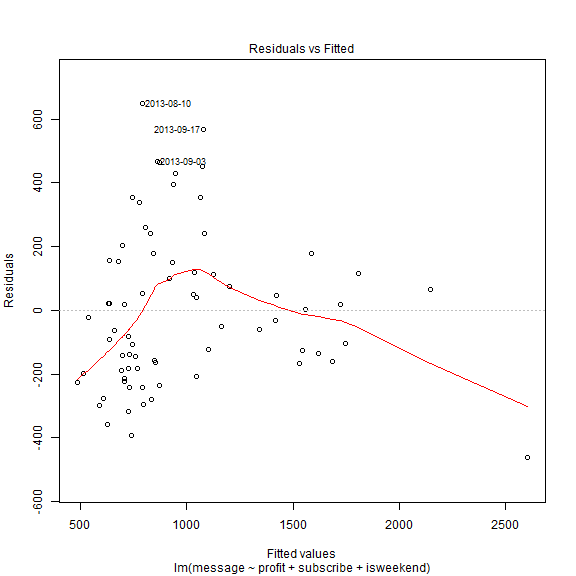

```
## Warning: pseudoinverse used at 24.787 0.99888 -0.012076
## Warning: neighborhood radius 4.6647
## Warning: reciprocal condition number  4.6732e-017
## Warning: There are other near singularities as well. 49.49
```

```
## 
## Call:
## lm(formula = message ~ profit + subscribe + isweekend, data = msgana)
## 
## Residuals:
##    Min     1Q Median     3Q    Max 
## -462.6 -182.9  -41.8  152.1  648.3 
## 
## Coefficients:
##                Estimate Std. Error t value Pr(>|t|)    
## (Intercept)   -3485.263    558.455   -6.24  3.2e-08 ***
## profit         3288.960    466.162    7.06  1.1e-09 ***
## subscribe         4.468      0.807    5.53  5.4e-07 ***
## isweekendTRUE    71.695     67.310    1.07     0.29    
## ---
## Signif. codes:  0 '***' 0.001 '**' 0.01 '*' 0.05 '.' 0.1 ' ' 1
## 
## Residual standard error: 249 on 68 degrees of freedom
## Multiple R-squared:  0.739,	Adjusted R-squared:  0.728 
## F-statistic: 64.2 on 3 and 68 DF,  p-value: <2e-16
```

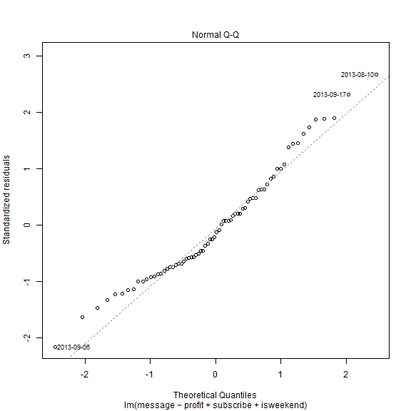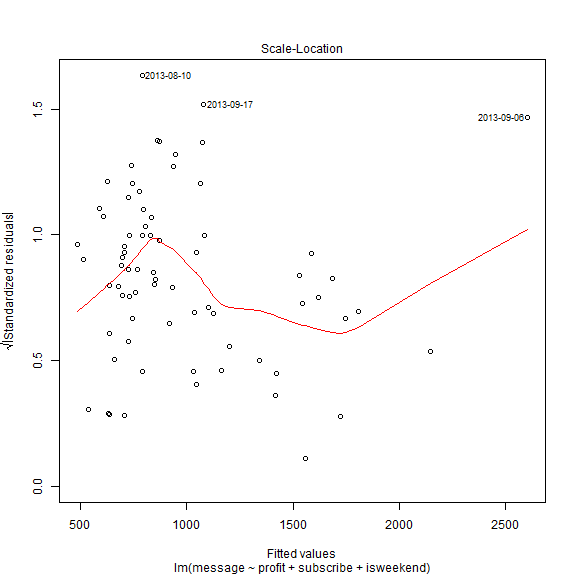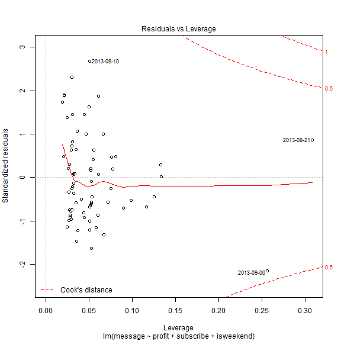


You can also embed plots, for example:

 


other
----------------


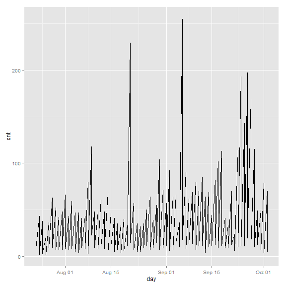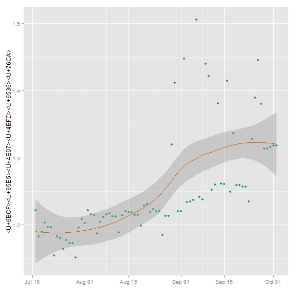


* 每日增加关注用户数


```
## [1] 50 43 38 21 36 63
```


```
## Warning: Incompatible methods ("+.gg", "Ops.data.frame") for "+"
```

```
## Error: non-numeric argument to binary operator
```


```
##    Min. 1st Qu.  Median    Mean 3rd Qu.    Max. 
##    18.0    35.0    47.0    61.2    70.0   237.0
```

```
## [1] 61.21
```

```
## [1] 43.84
```


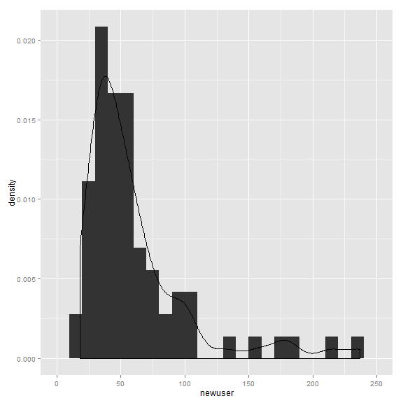


```
## Length  Class   Mode 
##      0   NULL   NULL
```

```
## Warning: argument is not numeric or logical: returning NA
```

```
## [1] NA
```

```
## [1] NA
```


```
## Error: object 'unfollower' not found
```


```
## Warning: no non-missing arguments to min; returning Inf
## Warning: no non-missing arguments to max; returning -Inf
```

```
## Error: object 'newfollower' not found
```

