---
layout: post
title: "余额宝快报微信公众平台数据分析报告"
description: ""
category: statistics
tags: [wechat , weibo , ali_bao ]
---


摘要：

【余额宝快报】是基于微信，提供余额宝（天弘增利宝货币基金）收益播报，计算，查询及常见问题回答的微信公共平台。本文是对该平台后台数据的分析与挖据，主要内容包括：1.对基金每日收益进行分析；2.对用户及其订阅及取消订阅行为进行分析；3.对消息及其种类，发送时间等信息进行分析；4.对每日新增关注人数进行回归分析；5.对每日消息数进行挖据分析。本文使用R语言作为工具，使用ggplot2包进行绘图，使用knitr+markdown进行文档编辑。

观点：
* 1.  快报男性用户是女性用户的2倍，男性更爱“理财”
* 2.	很多用户通过向【快报】提问，获取余额宝相关的信息
* 3.	【快报】每天的活跃用户数并没有随着用户的增加而增加，用户活跃度度相在降低


报告文档[下载]({{}}/adds/kuaibao/余额宝快报平台数据研究报告Ⅱ.pdf)


1 概述
-----------------------


### 1.1  报告所涉数据来源

本报告所涉主要数据均来自「余额宝快报」微信公共平台所收集的数据，时间范围为2013年7月23日起至2013年10月2日止。
  
「余额宝快报」微信公共平台于7月13号注册，后台开发于7月21日完成，从23日开始产生完整的信息数据记录，所以本报告以2013年7月23日起至2013年10月2日止，77个自然日的数据为样本。

### 1.2	为什么要做这样的报告分析

「余额宝快报」微信公共平台推出以来受到用户欢迎，目前累计用户超过5000，每天处理1800次以上的用户互动查询，但用户及每天互动的消息数增长速度并未达到预期。通过本报告，了解细化用户的需求，了解他们的活跃时间，推出个性化的内容及服务。

  
2 数据分析与可视化
-----------------------

### 2.1	整体概况

截至2013-10-2日，余额宝快报共有4913位用户，其中7月23日起至10月2日共新增用户4407名。

### 2.2 数据准备

为了便于分析,先将系统Mysql数据库的数据整理出，存在[本地](https://github.com/sunnotes/Programming-R/blob/master/kuaibao/kuaibao.RData)，通过```load(file =' ')```可以直接调用，从数据库加载到本地文件的代码详见我的[代码库](https://github.com/sunnotes/Programming-R/blob/master/kuaibao/dataobject.R)

安装并加载依赖的R库


```r

load(file = "kuaibao.RData")
# install.packages('ggplot2')
library(ggplot2)
library(timeDate)
library(reshape2)
```


### 2.3 基金收益分析

#### 2.3.1 基金收益样例数据


```r
head(kuaibao.fund)
```

```
##          day profit  rate          updatetime
## 1 2013-07-16  1.221 4.634 2013-07-16 00:00:00
## 2 2013-07-17  1.183 4.582 2013-07-17 22:17:35
## 3 2013-07-18  1.190 4.543 2013-07-18 19:16:03
## 4 2013-07-19  1.203 4.518 2013-07-19 19:05:59
## 5 2013-07-20  1.196 4.494 2013-07-20 08:10:25
## 6 2013-07-21  1.196 4.471 2013-07-21 00:04:50
```

 * day  是日期数据，一天一份，数据从2013-07-16开始
 * profit  是增利宝（余额宝基金公司）每日公布的每万份收益额
 * rate 是增利宝每日公布的七日年化收益率
 * updatetime 是该收益的更新时间

#### 2.3.2 基金收益数据分析：


```r
summary(kuaibao.fund)
```

```
##       day                 profit          rate     
##  Min.   :2013-07-16   Min.   :1.15   Min.   :4.37  
##  1st Qu.:2013-08-04   1st Qu.:1.21   1st Qu.:4.51  
##  Median :2013-08-24   Median :1.22   Median :4.55  
##  Mean   :2013-08-24   Mean   :1.25   Mean   :4.66  
##  3rd Qu.:2013-09-12   3rd Qu.:1.26   3rd Qu.:4.86  
##  Max.   :2013-10-02   Max.   :1.51   Max.   :5.07  
##    updatetime                 
##  Min.   :2013-07-16 00:00:00  
##  1st Qu.:2013-08-05 01:49:44  
##  Median :2013-08-24 09:25:04  
##  Mean   :2013-08-24 15:28:10  
##  3rd Qu.:2013-09-13 05:59:38  
##  Max.   :2013-10-02 08:48:46
```

通过对基金的收益分析可以看出：1)系统的统计时（day）间为2013-07-16到 2013-10-02;
2)每日万份收益最小值为1.15，最大值为1.51，均值为1.25

下面对每日万份收益做详细的分析
* 每日万份收益 整体分析

```r
summary(kuaibao.fund$profit)
```

```
##    Min. 1st Qu.  Median    Mean 3rd Qu.    Max. 
##    1.15    1.21    1.22    1.25    1.26    1.51
```

 * 均值与方差


```r
mean(kuaibao.fund$profit)
```

```
## [1] 1.252
```

```r
sd(kuaibao.fund$profit)
```

```
## [1] 0.07796
```


判断收益是否符合正态分布

```r
shapiro.test(kuaibao.fund$profit)
```

```
## 
## 	Shapiro-Wilk normality test
## 
## data:  kuaibao.fund$profit
## W = 0.8255, p-value = 3.088e-08
```

p值明显小于0.05，表明数据不符合正态分布。

 * 每日万份收益统计时间序列图


```r
ggplot(kuaibao.fund, aes(x = day, y = profit)) + geom_point(color = "#009E73") + 
    geom_smooth(method = "loess", color = "#D55E00") + scale_x_date() + xlab("") + 
    ylab("profit")
```

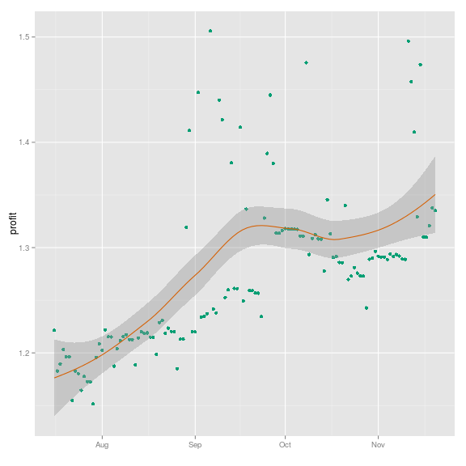

由上图可以看出，通过loess（局部加权回归散点平滑法locally weighted scatterplot smoothing，LOWESS或LOESS）回归拟合，在8月25日-9月25日拟合较差，这期间收益涨跌幅度较大。

 * 每日万份收益统计箱须图


```r
ggplot(kuaibao.fund, aes(x = day, y = profit)) + geom_point(color = "#009E73") + 
    geom_boxplot(colour = "#56B4E9", alpha = 0.1)
```

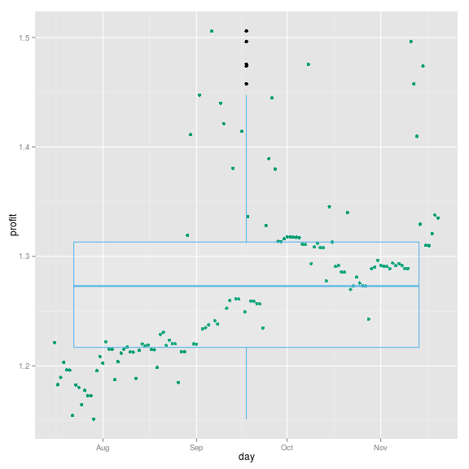


* 每日万份收益统计直方图

```r
ggplot(kuaibao.fund, aes(x = profit)) + geom_histogram(aes(y = ..count..), binwidth = 0.02, 
    colour = "black", fill = "white") + geom_density(alpha = 0.2, fill = "#FF6666")
```

```
## Warning: position_stack requires constant width: output may be incorrect
```

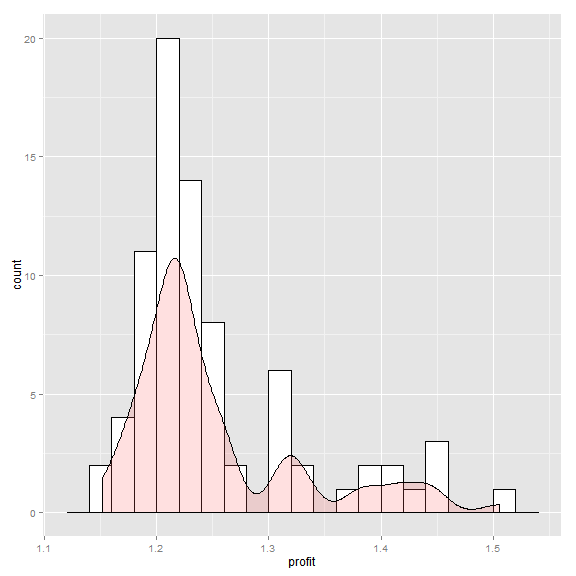


通过对万份收益数据的分布拟合，也表明样本数据不符合正态分布。


### 2.4用户分析


#### 2.4.1 用户样例数据


```r
head(kuaibao.user)
```

```
##          day subscribe unsubscribe newuser totaluser activeuser
## 1 2013-07-23        50           9      41       547        137
## 2 2013-07-24        43           2      41       588        124
## 3 2013-07-25        38           3      35       623        128
## 4 2013-07-26        21           2      19       642        116
## 5 2013-07-27        36           9      27       669        124
## 6 2013-07-28        63           9      54       723        148
```

其中，

 * day  是日期数据，一天一份，数据从2013-07-23开始
 * subscribe 表示每日新关注人数
 * unsubscribe 表示每日取消关注人数
 * newuser 表示净增关注人数
 * newuser totaluser表示累计关注人数

#### 2.4.2 用户数据统计分析

```r
summary(kuaibao.user)
```

```
##       day               subscribe      unsubscribe    newuser     
##  Min.   :2013-07-23   Min.   : 21.0   Min.   : 2   Min.   : 18.0  
##  1st Qu.:2013-08-09   1st Qu.: 42.8   1st Qu.: 7   1st Qu.: 35.0  
##  Median :2013-08-27   Median : 57.0   Median : 9   Median : 47.0  
##  Mean   :2013-08-27   Mean   : 70.2   Mean   : 9   Mean   : 61.2  
##  3rd Qu.:2013-09-14   3rd Qu.: 79.2   3rd Qu.:11   3rd Qu.: 70.0  
##  Max.   :2013-10-02   Max.   :255.0   Max.   :23   Max.   :237.0  
##    totaluser    activeuser.activeuser
##  Min.   : 547   Min.   :116.0        
##  1st Qu.:1342   1st Qu.:236.2        
##  Median :2186   Median :410.5        
##  Mean   :2398   Mean   :421.1        
##  3rd Qu.:3420   3rd Qu.:588.8        
##  Max.   :4913   Max.   :910.0
```


* 对数据进行重塑

通过melt融合数据,为使统计更直观，暂时取消,newuser,totaluser数据

```r
kuaibao.user.melt <- melt(kuaibao.user[, 1:3], id = "day", variable.name = "type", 
    value.name = "cnt")
```


融合后代数据样例


```r
head(kuaibao.user.melt)
```

```
##          day      type cnt
## 1 2013-07-23 subscribe  50
## 2 2013-07-24 subscribe  43
## 3 2013-07-25 subscribe  38
## 4 2013-07-26 subscribe  21
## 5 2013-07-27 subscribe  36
## 6 2013-07-28 subscribe  63
```


* 用户每日时间序列图


```r
ggplot(kuaibao.user.melt, aes(day, cnt, group = type, colour = type)) + geom_line() + 
    geom_point() + geom_smooth(method = "loess") + scale_x_date() + xlab("") + 
    ylab("")
```

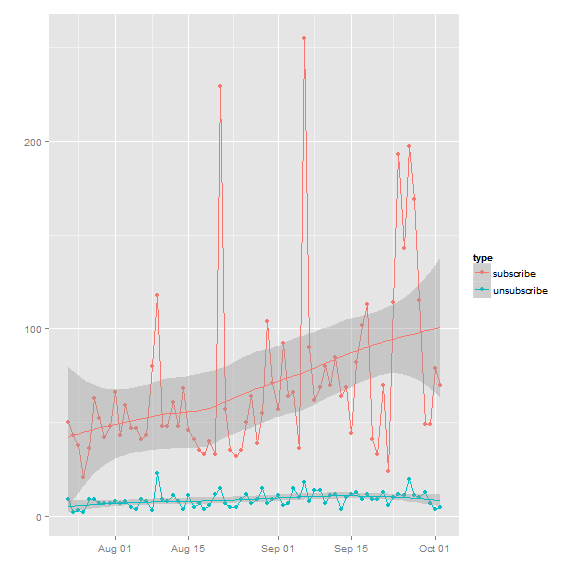


由上图可以大致看出，每日新增关注人数和每日取消关注人数有一定的关联关系，当新增用户数增加时，取消关注的人数也会增加。


```r
subscribe.scaled = scale(kuaibao.user$subscribe)
unsubscribe.scaled = scale(kuaibao.user$unsubscribe)
user.scaled = data.frame(kuaibao.user$day, subscribe.scaled, unsubscribe.scaled)
user.scaled.melt = melt(user.scaled, id = "kuaibao.user.day", variable.name = "type", 
    value.name = "cnt")
ggplot(user.scaled.melt, aes(kuaibao.user.day, cnt, group = type, colour = type)) + 
    geom_line() + geom_point() + geom_smooth() + scale_x_date() + xlab("") + 
    ylab("User cnt")
```

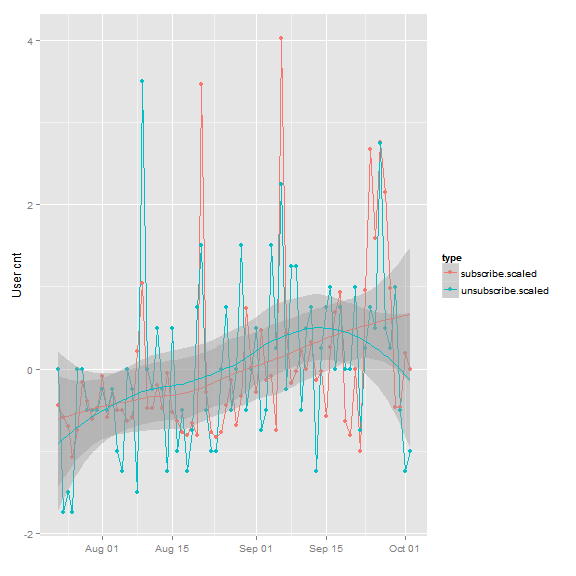

上图图为将数据进行标准正态化后的比较，二者的关联关系较为明显。

#### 2.3.4  每日累计用户数时间序列图

```r

ggplot(kuaibao.user, aes(day, totaluser)) + geom_line() + geom_point() + geom_smooth() + 
    scale_x_date() + xlab("") + ylab("")
```

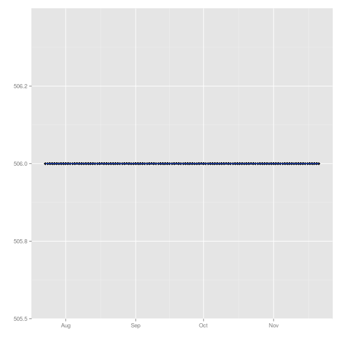


可以看出，每天


#### 2.3.5 重点研究每日净新增的用户人数


```r
summary(kuaibao.user$newuser)
```

```
##    Min. 1st Qu.  Median    Mean 3rd Qu.    Max. 
##    18.0    35.0    47.0    61.2    70.0   237.0
```


```r
ggplot(kuaibao.user, aes(x = day, y = newuser)) + geom_point(color = "#009E73") + 
    geom_smooth(method = "loess", color = "#D55E00") + scale_x_date() + xlab("") + 
    ylab("cnt")
```

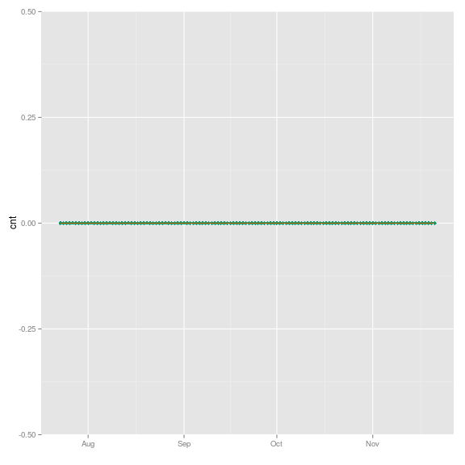

通过loess拟合，没发现数据的规律。

#### 2.3.6 用户性别分析


```r
cnt <- c(3164, 1514, 199)
gen = c("<U+7537><U+6027>", "<U+5973><U+6027>", "<U+672A><U+77E5>")
pct = round(cnt/sum(cnt) * 100)
lab = paste(gen, " ", pct, "%")
```


由于系统后台无法采集完整的性别数据，该数据直接取自微信公众号后台。

所有关注者中，男性3164名，女性1514名，性别未知199名。

男女比例为2.1：1

详见下图：

```r
colors <- c("#56B4E9", "#009E73", "#D55E00")
pie(cnt, labels = lab, col = colors, main = "<U+8BA2><U+9605><U+7528><U+6237><U+6027><U+522B><U+6BD4><U+4F8B><U+56FE>")
```

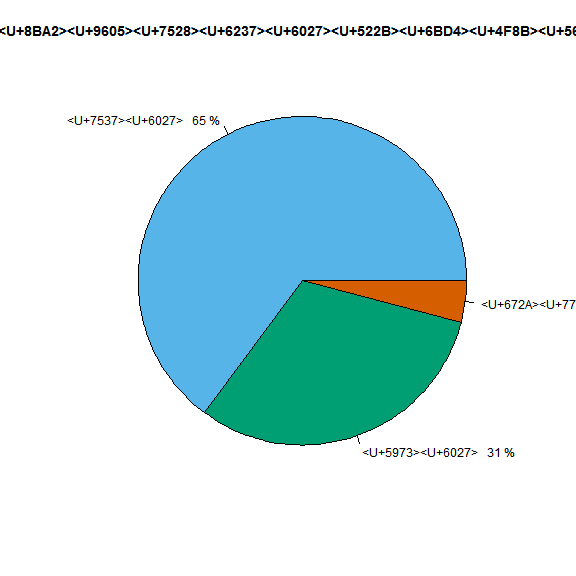

```r

# ggplot(kuaibao.user.gender, aes(x = '' ,y = pct, fill = gen),stat = 'bin')
# + geom_bar(width = 3) + coord_polar('y')+ xlab('') + ylab('') +
# labs(fill='lab')
```


#### 2.3.7 用户活跃度分析

```r
rate <- round(kuaibao.user$activeuser/kuaibao.user$totaluser, 2)
active <- data.frame(kuaibao.user$day, rate)
colnames(active) <- c("day", "rate")
ggplot(active, aes(x = day, y = rate)) + geom_point(color = "#009E73") + geom_smooth(method = "loess", 
    color = "#D55E00") + scale_x_date() + xlab("") + ylab("")
```

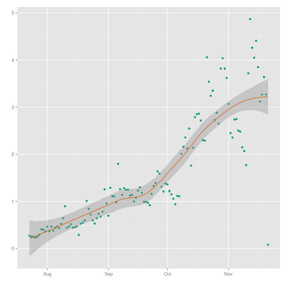


### 2.4 消息统计分析

#### 2.4.1 消息样例数据

```r
head(kuaibao.messages, 10)
```

```
##     id userid sex             msgtime        day hour msg_type type_detail
## 1  254      5   1 2013-07-23 00:24:03 2013-07-23    0        1       query
## 2  255      5   1 2013-07-23 00:38:35 2013-07-23    0        1       query
## 3  256      5   1 2013-07-23 00:38:41 2013-07-23    0        1       query
## 4  257      5   1 2013-07-23 00:45:03 2013-07-23    0        5 unsubscribe
## 5  258      5   1 2013-07-23 00:46:24 2013-07-23    0        5   subscribe
## 6  259     16   1 2013-07-23 01:46:28 2013-07-23    1        1     compute
## 7  260     16   1 2013-07-23 01:46:52 2013-07-23    1        1     compute
## 8  261     87   0 2013-07-23 03:30:59 2013-07-23    3        5   subscribe
## 9  262     88   0 2013-07-23 04:04:08 2013-07-23    4        5   subscribe
## 10 263      0   1 2013-07-23 05:01:19 2013-07-23    5        1     compute
##    content
## 1       cx
## 2   查询
## 3       cx
## 4     <NA>
## 5     <NA>
## 6  Js35924
## 7  Js35624
## 8     <NA>
## 9     <NA>
## 10 js10000
```

#### 2.4.2 消息总体分析

```r
dim(kuaibao.messages)
```

```
## [1] 70869     9
```

```r

summary(kuaibao.messages)
```

```
##        id            userid          sex      
##  Min.   :  254   Min.   :   0   Min.   :0     
##  1st Qu.:18241   1st Qu.: 797   1st Qu.:0     
##  Median :35958   Median :1940   Median :1     
##  Mean   :35954   Mean   :2093   Mean   :1     
##  3rd Qu.:53675   3rd Qu.:3067   3rd Qu.:1     
##  Max.   :71392   Max.   :5393   Max.   :2     
##                                 NA's   :5306  
##     msgtime                         day                  hour     
##  Min.   :2013-07-23 00:24:03   Min.   :2013-07-23   Min.   : 0.0  
##  1st Qu.:2013-08-21 23:48:05   1st Qu.:2013-08-21   1st Qu.:11.0  
##  Median :2013-09-07 10:15:19   Median :2013-09-07   Median :17.0  
##  Mean   :2013-09-04 22:36:36   Mean   :2013-09-04   Mean   :14.8  
##  3rd Qu.:2013-09-20 20:11:58   3rd Qu.:2013-09-20   3rd Qu.:19.0  
##  Max.   :2013-10-02 20:13:20   Max.   :2013-10-02   Max.   :23.0  
##                                                                   
##     msg_type       type_detail       content     
##  Min.   :1.00   compute  :41201   c      : 6785  
##  1st Qu.:1.00   query    :14319   001    : 2458  
##  Median :1.00   question : 5759   C      : 2318  
##  Mean   :1.33   subscribe: 5055   收益 : 1720  
##  3rd Qu.:1.00   help     : 1607   10000  : 1375  
##  Max.   :5.00   other    : 1425   (Other):50367  
##                 (Other)  : 1503   NA's   : 5846
```


共有70869条数据记录

#### 2.4.3 不同消息数量对比


```r
library(scales)
ggplot(kuaibao.messages, aes(x = type_detail, color = type_detail, fill = type_detail)) + 
    geom_histogram() + scale_y_log10(breaks = trans_breaks("log10", function(x) 10^x), 
    labels = trans_format("log10", math_format(10^.x))) + xlab("") + ylab("")
```

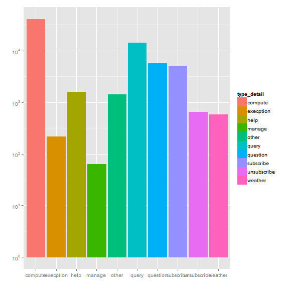


#### 2.4.4 每天的消息数比较

```r
ggplot(kuaibao.messages, aes(x = day)) + geom_histogram(aes(y = ..count..), 
    binwidth = 0.5) + geom_rect(data = kuaibao.messages, aes(xmin = day, xmax = day + 
    1, fill = isWeekend(day)), ymin = 0, ymax = 2500, alpha = 0.005) + xlab("") + 
    ylab("")
```

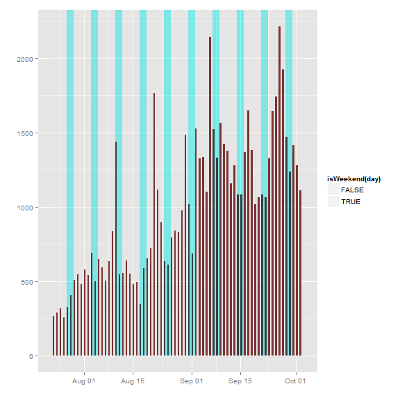

蓝色背景表示当天是周末，可以看到一般在周末，消息数量就会较少。

每天不同类型的消息比较

```r
ggplot(kuaibao.messages, aes(x = day, fill = type_detail)) + geom_histogram(aes(y = ..count..), 
    binwidth = 0.5) + xlab("") + ylab("")
```

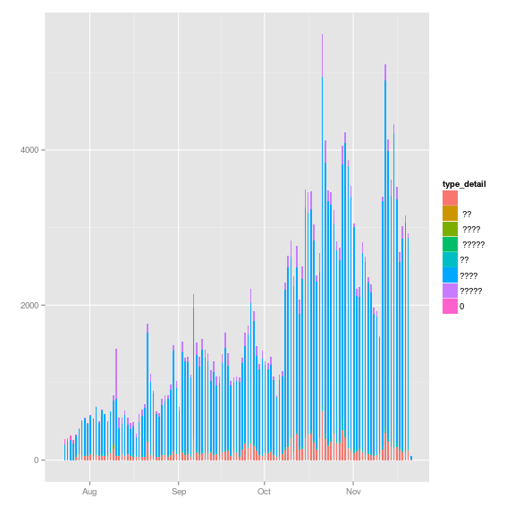


3  数据挖掘分析
-------------


### 3.1 每日新增关注人数

通过前面的分析,可以大致的看出,每日新增人数和每日万份收益,是否是周末有一定的关系.通过对数据做正态标准化,详见下图


```r

fund.profits = kuaibao.fund[-(1:7), ]
# dim(fund.profits) head(fund.profits) head(kuaibao.user) dim(kuaibao.user)
subscribeanalysis = data.frame(fund.profits$day, fund.profits$profit, kuaibao.user$subscribe, 
    isWeekend(fund.profits$day))
colnames(subscribeanalysis) <- c("day", "profit", "subscribe", "isweekend")
head(subscribeanalysis)
```

```
##                   day profit subscribe isweekend
## 2013-07-23 2013-07-23  1.183        50     FALSE
## 2013-07-24 2013-07-24  1.181        43     FALSE
## 2013-07-25 2013-07-25  1.165        38     FALSE
## 2013-07-26 2013-07-26  1.178        21     FALSE
## 2013-07-27 2013-07-27  1.173        36      TRUE
## 2013-07-28 2013-07-28  1.173        63      TRUE
```

```r

scalesubscribeanalysis = scale(subscribeanalysis[, 2:3])
head(scalesubscribeanalysis)
```

```
##             profit subscribe
## 2013-07-23 -0.9472   -0.4405
## 2013-07-24 -0.9738   -0.5931
## 2013-07-25 -1.1760   -0.7021
## 2013-07-26 -1.0091   -1.0726
## 2013-07-27 -1.0711   -0.7457
## 2013-07-28 -1.0736   -0.1571
```

```r

meltsubscribeanalysis <- melt(scalesubscribeanalysis, id = "day", variable.name = c("day", 
    "type"))


ggplot(meltsubscribeanalysis, aes(Var1, value, group = Var2, colour = Var2)) + 
    geom_line() + geom_point() + geom_smooth(method = "loess") + scale_x_date() + 
    xlab("") + ylab("")
```

```
## Error: Invalid input: date_trans works with objects of class Date only
```


对


```r
fm <- lm(formula = subscribe ~ profit + isweekend, data = subscribeanalysis)

summary(fm)
```

```
## 
## Call:
## lm(formula = subscribe ~ profit + isweekend, data = subscribeanalysis)
## 
## Residuals:
##    Min     1Q Median     3Q    Max 
##  -64.9  -19.4   -3.0   10.9  164.8 
## 
## Coefficients:
##               Estimate Std. Error t value Pr(>|t|)    
## (Intercept)    -345.85      72.13   -4.80  9.0e-06 ***
## profit          333.18      56.78    5.87  1.4e-07 ***
## isweekendTRUE   -10.52       9.96   -1.06     0.29    
## ---
## Signif. codes:  0 '***' 0.001 '**' 0.01 '*' 0.05 '.' 0.1 ' ' 1
## 
## Residual standard error: 37.1 on 69 degrees of freedom
## Multiple R-squared:  0.364,	Adjusted R-squared:  0.346 
## F-statistic: 19.7 on 2 and 69 DF,  p-value: 1.66e-07
```

```r
plot(fm$residuals)
```

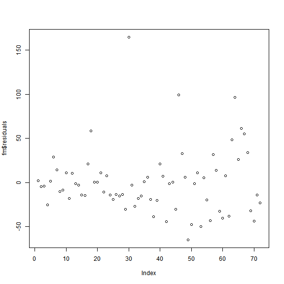

```r

```


```r
subscribeanalysis2 <- subscribeanalysis
sa <- subset(subscribeanalysis2, day != "2013-08-21")
sa <- subset(sa, day != "2013-09-06")
sa <- subset(sa, day != "2013-09-24")
dim(sa)
```

```
## [1] 69  4
```

```r
fm2 <- lm(formula = subscribe ~ profit + isweekend, data = sa)
summary(fm2)
```

```
## 
## Call:
## lm(formula = subscribe ~ profit + isweekend, data = sa)
## 
## Residuals:
##    Min     1Q Median     3Q    Max 
## -45.08 -16.63  -2.74   9.62  81.63 
## 
## Coefficients:
##               Estimate Std. Error t value Pr(>|t|)    
## (Intercept)    -264.77      54.34   -4.87  7.2e-06 ***
## profit          263.09      42.97    6.12  5.7e-08 ***
## isweekendTRUE    -5.20       6.99   -0.74     0.46    
## ---
## Signif. codes:  0 '***' 0.001 '**' 0.01 '*' 0.05 '.' 0.1 ' ' 1
## 
## Residual standard error: 25.9 on 66 degrees of freedom
## Multiple R-squared:  0.383,	Adjusted R-squared:  0.364 
## F-statistic: 20.5 on 2 and 66 DF,  p-value: 1.2e-07
```

```r

fm3 <- lm(formula = subscribe ~ profit, data = sa)
summary(fm3)
```

```
## 
## Call:
## lm(formula = subscribe ~ profit, data = sa)
## 
## Residuals:
##    Min     1Q Median     3Q    Max 
## -44.63 -20.10  -3.49  11.35  82.05 
## 
## Coefficients:
##             Estimate Std. Error t value Pr(>|t|)    
## (Intercept)   -273.4       52.9   -5.17  2.3e-06 ***
## profit         268.8       42.1    6.38  1.9e-08 ***
## ---
## Signif. codes:  0 '***' 0.001 '**' 0.01 '*' 0.05 '.' 0.1 ' ' 1
## 
## Residual standard error: 25.8 on 67 degrees of freedom
## Multiple R-squared:  0.378,	Adjusted R-squared:  0.368 
## F-statistic: 40.7 on 1 and 67 DF,  p-value: 1.93e-08
```

```r

```


通过线性回归可以看出，和是否是周末没有太大的关系
绘图展示

```r
ggplot(subscribeanalysis, aes(x = profit, y = subscribe)) + geom_point(color = "#009E73") + 
    geom_smooth(method = "lm", color = "#D55E00", lwd = 2) + xlab("profit") + 
    ylab("subscribe")
```

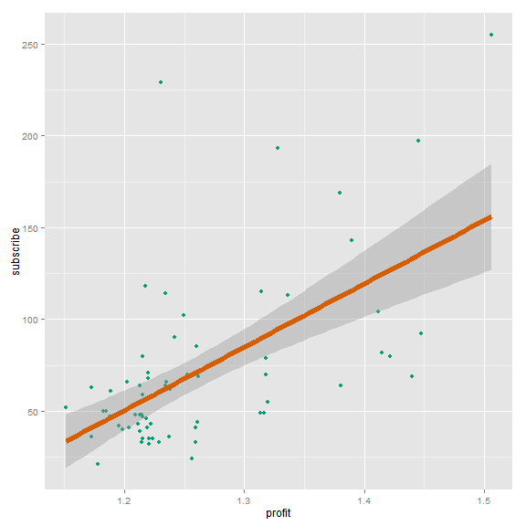

```r


ggplot(subscribeanalysis, aes(x = profit, y = subscribe)) + geom_point(color = "#009E73") + 
    geom_smooth(method = "loess", color = "#CC79A7", lwd = 2) + xlab("profit") + 
    ylab("subscribe")
```


```r

loess.subscribeanalysis <- loess(subscribe ~ profit, data = subscribeanalysis2)
summary(loess.subscribeanalysis)
```

```
## Call:
## loess(formula = subscribe ~ profit, data = subscribeanalysis2)
## 
## Number of Observations: 72 
## Equivalent Number of Parameters: 5.2 
## Residual Standard Error: 36.5 
## Trace of smoother matrix: 5.7 
## 
## Control settings:
##   normalize:  TRUE 
##   span	    :  0.75 
##   degree   :  2 
##   family   :  gaussian
##   surface  :  interpolate	  cell = 0.2
```


### 3.2 每天消息数做分析


```r
head(kuaibao.messages)
```

```
##    id userid sex             msgtime        day hour msg_type type_detail
## 1 254      5   1 2013-07-23 00:24:03 2013-07-23    0        1       query
## 2 255      5   1 2013-07-23 00:38:35 2013-07-23    0        1       query
## 3 256      5   1 2013-07-23 00:38:41 2013-07-23    0        1       query
## 4 257      5   1 2013-07-23 00:45:03 2013-07-23    0        5 unsubscribe
## 5 258      5   1 2013-07-23 00:46:24 2013-07-23    0        5   subscribe
## 6 259     16   1 2013-07-23 01:46:28 2013-07-23    1        1     compute
##   content
## 1      cx
## 2  查询
## 3      cx
## 4    <NA>
## 5    <NA>
## 6 Js35924
```

```r
dim(kuaibao.messages)
```

```
## [1] 70869     9
```

```r

messagesperday <- tapply(kuaibao.messages$id, kuaibao.messages$day, length)
# head(messagesperday) dim(messagesperday) class(messagesperday)
msgana <- data.frame(kuaibao.fund[-(1:7), ]$day, kuaibao.fund[-(1:7), ]$profit, 
    kuaibao.user$subscribe, messagesperday, isWeekend(kuaibao.fund[-(1:7), ]$day))
colnames(msgana) <- c("day", "profit", "subscribe", "message", "isweekend")
head(msgana)
```

```
##                   day profit subscribe message isweekend
## 2013-07-23 2013-07-23  1.183        50     269     FALSE
## 2013-07-24 2013-07-24  1.181        43     290     FALSE
## 2013-07-25 2013-07-25  1.165        38     317     FALSE
## 2013-07-26 2013-07-26  1.178        21     257     FALSE
## 2013-07-27 2013-07-27  1.173        36     327      TRUE
## 2013-07-28 2013-07-28  1.173        63     406      TRUE
```


#### 3.2.1 时间序列分析

```r

messagestimeseries <- ts(msgana$message)
plot.ts(messagestimeseries)
```

```
## Error: subscript out of bounds
```

```r
messagestimeseriesSMA3 <- SMA(messagestimeseries, n = 5)
```

```
## Error: could not find function "SMA"
```

```r
plot.ts(messagestimeseriesSMA3)
```

```
## Error: object 'messagestimeseriesSMA3' not found
```


#### 3.2.2 多元线性回归

```r
lm.msgana <- lm(message ~ profit + subscribe + isweekend, data = msgana)
summary(lm.msgana)
```

```
## 
## Call:
## lm(formula = message ~ profit + subscribe + isweekend, data = msgana)
## 
## Residuals:
##    Min     1Q Median     3Q    Max 
## -462.6 -182.9  -41.8  152.1  648.3 
## 
## Coefficients:
##                Estimate Std. Error t value Pr(>|t|)    
## (Intercept)   -3485.263    558.455   -6.24  3.2e-08 ***
## profit         3288.960    466.162    7.06  1.1e-09 ***
## subscribe         4.468      0.807    5.53  5.4e-07 ***
## isweekendTRUE    71.695     67.310    1.07     0.29    
## ---
## Signif. codes:  0 '***' 0.001 '**' 0.01 '*' 0.05 '.' 0.1 ' ' 1
## 
## Residual standard error: 249 on 68 degrees of freedom
## Multiple R-squared:  0.739,	Adjusted R-squared:  0.728 
## F-statistic: 64.2 on 3 and 68 DF,  p-value: <2e-16
```

```r

anova(lm.msgana)
```

```
## Analysis of Variance Table
## 
## Response: message
##           Df   Sum Sq  Mean Sq F value  Pr(>F)    
## profit     1 10023644 10023644  161.84 < 2e-16 ***
## subscribe  1  1835424  1835424   29.63 7.7e-07 ***
## isweekend  1    70267    70267    1.13    0.29    
## Residuals 68  4211540    61934                    
## ---
## Signif. codes:  0 '***' 0.001 '**' 0.01 '*' 0.05 '.' 0.1 ' ' 1
```

```r

lm2.msgana <- lm(message ~ profit + subscribe, data = msgana)
summary(lm2.msgana)
```

```
## 
## Call:
## lm(formula = message ~ profit + subscribe, data = msgana)
## 
## Residuals:
##    Min     1Q Median     3Q    Max 
## -451.9 -197.4  -55.5  152.6  695.7 
## 
## Coefficients:
##              Estimate Std. Error t value Pr(>|t|)    
## (Intercept) -3404.200    553.784   -6.15  4.5e-08 ***
## profit       3246.395    464.898    6.98  1.4e-09 ***
## subscribe       4.359      0.802    5.44  7.7e-07 ***
## ---
## Signif. codes:  0 '***' 0.001 '**' 0.01 '*' 0.05 '.' 0.1 ' ' 1
## 
## Residual standard error: 249 on 69 degrees of freedom
## Multiple R-squared:  0.735,	Adjusted R-squared:  0.727 
## F-statistic: 95.6 on 2 and 69 DF,  p-value: <2e-16
```

```r

anova(lm.msgana, lm2.msgana)
```

```
## Analysis of Variance Table
## 
## Model 1: message ~ profit + subscribe + isweekend
## Model 2: message ~ profit + subscribe
##   Res.Df     RSS Df Sum of Sq    F Pr(>F)
## 1     68 4211540                         
## 2     69 4281807 -1    -70267 1.13   0.29
```

```r

final.lm.msgana <- step(lm.msgana)
```

```
## Start:  AIC=798.3
## message ~ profit + subscribe + isweekend
## 
##             Df Sum of Sq     RSS AIC
## - isweekend  1     70267 4281807 798
## <none>                   4211540 798
## - subscribe  1   1897233 6108773 823
## - profit     1   3083015 7294555 836
## 
## Step:  AIC=797.5
## message ~ profit + subscribe
## 
##             Df Sum of Sq     RSS AIC
## <none>                   4281807 798
## - subscribe  1   1835424 6117231 821
## - profit     1   3025968 7307775 834
```

```r
plot(lm.msgana)
```


```r

final.lm.msgana.predictions <- predict(final.lm.msgana, msgana)

plot(final.lm.msgana.predictions, msgana$message)
abline(0, 1, lty = 2)
```


```r

shapiro.test(msgana$subscribe)
```

```
## 
## 	Shapiro-Wilk normality test
## 
## data:  msgana$subscribe
## W = 0.7464, p-value = 7.949e-10
```

```r

glm.msgana <- glm(message ~ profit + subscribe, family = gaussian, data = msgana)

summary(glm.msgana)
```

```
## 
## Call:
## glm(formula = message ~ profit + subscribe, family = gaussian, 
##     data = msgana)
## 
## Deviance Residuals: 
##    Min      1Q  Median      3Q     Max  
## -451.9  -197.4   -55.5   152.6   695.7  
## 
## Coefficients:
##              Estimate Std. Error t value Pr(>|t|)    
## (Intercept) -3404.200    553.784   -6.15  4.5e-08 ***
## profit       3246.395    464.898    6.98  1.4e-09 ***
## subscribe       4.359      0.802    5.44  7.7e-07 ***
## ---
## Signif. codes:  0 '***' 0.001 '**' 0.01 '*' 0.05 '.' 0.1 ' ' 1
## 
## (Dispersion parameter for gaussian family taken to be 62055)
## 
##     Null deviance: 16140875  on 71  degrees of freedom
## Residual deviance:  4281807  on 69  degrees of freedom
## AIC: 1004
## 
## Number of Fisher Scoring iterations: 2
```

```r
plot(glm.msgana)
```

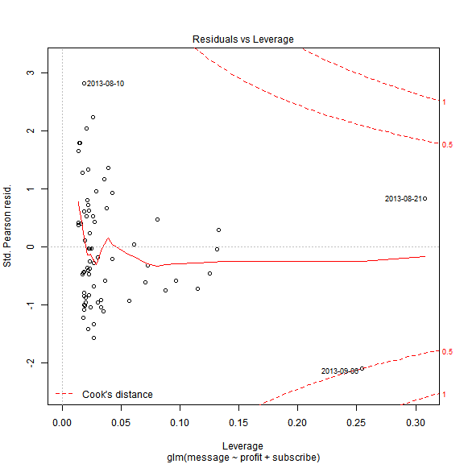

#### 3.2.3 loess回归分析

```r
loess.msgana <- loess(message ~ profit + subscribe, data = msgana)
summary(loess.msgana)
```

```
## Call:
## loess(formula = message ~ profit + subscribe, data = msgana)
## 
## Number of Observations: 72 
## Equivalent Number of Parameters: 10.99 
## Residual Standard Error: 248 
## Trace of smoother matrix: 12.99 
## 
## Control settings:
##   normalize:  TRUE 
##   span	    :  0.75 
##   degree   :  2 
##   family   :  gaussian
##   surface  :  interpolate	  cell = 0.2
```

```r

anova(lm.msgana, loess.msgana)
```

```
## Error: (list) object cannot be coerced to type 'double'
```

```r

lm2.msgana <- lm(message ~ profit + subscribe, data = msgana)
summary(lm2.msgana)
```

```
## 
## Call:
## lm(formula = message ~ profit + subscribe, data = msgana)
## 
## Residuals:
##    Min     1Q Median     3Q    Max 
## -451.9 -197.4  -55.5  152.6  695.7 
## 
## Coefficients:
##              Estimate Std. Error t value Pr(>|t|)    
## (Intercept) -3404.200    553.784   -6.15  4.5e-08 ***
## profit       3246.395    464.898    6.98  1.4e-09 ***
## subscribe       4.359      0.802    5.44  7.7e-07 ***
## ---
## Signif. codes:  0 '***' 0.001 '**' 0.01 '*' 0.05 '.' 0.1 ' ' 1
## 
## Residual standard error: 249 on 69 degrees of freedom
## Multiple R-squared:  0.735,	Adjusted R-squared:  0.727 
## F-statistic: 95.6 on 2 and 69 DF,  p-value: <2e-16
```

```r

anova(lm.msgana, lm2.msgana)
```

```
## Analysis of Variance Table
## 
## Model 1: message ~ profit + subscribe + isweekend
## Model 2: message ~ profit + subscribe
##   Res.Df     RSS Df Sum of Sq    F Pr(>F)
## 1     68 4211540                         
## 2     69 4281807 -1    -70267 1.13   0.29
```

```r

final.lm.msgana <- step(lm.msgana)
```

```
## Start:  AIC=798.3
## message ~ profit + subscribe + isweekend
## 
##             Df Sum of Sq     RSS AIC
## - isweekend  1     70267 4281807 798
## <none>                   4211540 798
## - subscribe  1   1897233 6108773 823
## - profit     1   3083015 7294555 836
## 
## Step:  AIC=797.5
## message ~ profit + subscribe
## 
##             Df Sum of Sq     RSS AIC
## <none>                   4281807 798
## - subscribe  1   1835424 6117231 821
## - profit     1   3025968 7307775 834
```

```r
plot(lm.msgana)
```

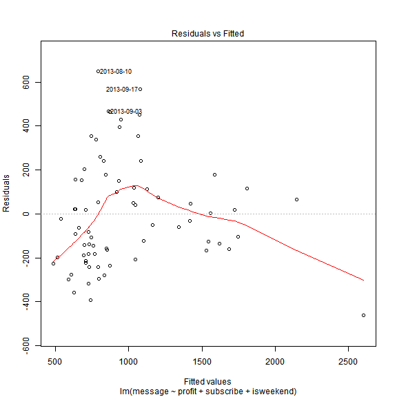

```r

final.lm.msgana.predictions <- predict(final.lm.msgana, msgana)

plot(final.lm.msgana.predictions, msgana$message)
abline(0, 1, lty = 2)
```


```r

shapiro.test(msgana$subscribe)
```

```
## 
## 	Shapiro-Wilk normality test
## 
## data:  msgana$subscribe
## W = 0.7464, p-value = 7.949e-10
```

```r

glm.msgana <- glm(message ~ profit + subscribe, family = gaussian, data = msgana)

summary(glm.msgana)
```

```
## 
## Call:
## glm(formula = message ~ profit + subscribe, family = gaussian, 
##     data = msgana)
## 
## Deviance Residuals: 
##    Min      1Q  Median      3Q     Max  
## -451.9  -197.4   -55.5   152.6   695.7  
## 
## Coefficients:
##              Estimate Std. Error t value Pr(>|t|)    
## (Intercept) -3404.200    553.784   -6.15  4.5e-08 ***
## profit       3246.395    464.898    6.98  1.4e-09 ***
## subscribe       4.359      0.802    5.44  7.7e-07 ***
## ---
## Signif. codes:  0 '***' 0.001 '**' 0.01 '*' 0.05 '.' 0.1 ' ' 1
## 
## (Dispersion parameter for gaussian family taken to be 62055)
## 
##     Null deviance: 16140875  on 71  degrees of freedom
## Residual deviance:  4281807  on 69  degrees of freedom
## AIC: 1004
## 
## Number of Fisher Scoring iterations: 2
```

```r
plot(glm.msgana)
```


